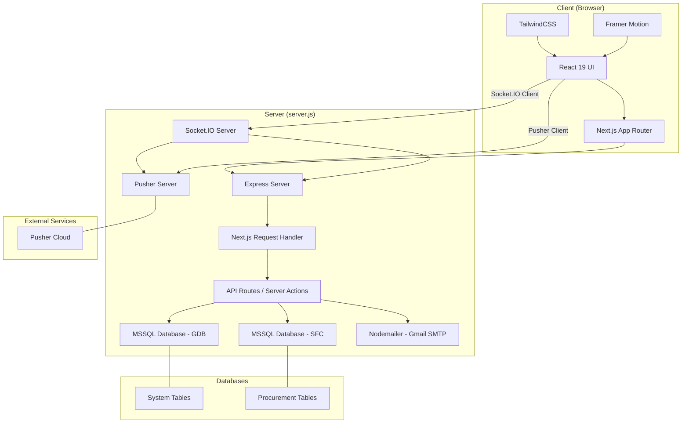

# ROADMAP.md - Developer Onboarding Guide & Self-Study Roadmap

Santeh Feeds Corporation ERP Web System (ORES) is a Next.js 16 procurement management application built for Santeh Feeds Corporation. This document serves as both a **developer onboarding guide** and a **self-study roadmap** for learning the technologies and concepts needed to understand, maintain, and extend the application.

---

## Table of Contents

1. [Project Overview](#1-project-overview)
2. [Project Structure](#2-project-structure)
3. [Technology Stack](#3-technology-stack)
4. [Learning Roadmap](#4-learning-roadmap)
5. [Tutorials](#5-tutorials)
6. [Official Documentation Links](#6-official-documentation-links)
7. [YouTube Resources](#7-youtube-resources)
8. [How the Project Works](#8-how-the-project-works)
9. [Development Workflow](#9-development-workflow)
10. [Troubleshooting Guide](#10-troubleshooting-guide)
11. [Beginner-Friendly Explanations](#11-beginner-friendly-explanations)

---

## 1. Project Overview

### What Is This Project?

The Santeh Feeds Corporation ERP Web System (ORES) is a web-based procurement management system for Santeh Feeds Corporation. It digitizes and automates the entire procurement workflow — from purchase request creation to receiving goods — with real-time notifications, OTP-based authentication, and role-based access control.

### Main Purpose

- **Digital Procurement Workflow**: Replace paper-based purchase requests with a fully digital system featuring approvals, canvassing, purchase orders, and receiving
- **Real-time Collaboration**: Notify users instantly when requests are approved, rejected, or need attention via Socket.IO and Pusher
- **Secure Access Control**: OTP-based authentication with daily session timeouts and module-level permissions
- **Audit Trail**: Comprehensive logging of all procurement activities for compliance and traceability

### Major Features / Modules

| Module | Description |
|---|---|
| **Authentication** | Bcrypt password verification, OTP via email, rate-limited login attempts |
| **User Management** | Account requests with approval workflow, profile editing, dark mode preferences |
| **Purchase Requests** | Create, edit, cancel purchase requests with transaction safety, rush flag support |
| **Request Evaluation** | Evaluate pending requests, approve/reject with comments, canvass integration |
| **Canvassing** | Supplier quotations comparison, canvass approval workflow |
| **Purchase Orders** | PO creation from approved canvasses, status tracking |
| **Receiving Entry** | Goods receipt recording, PO status updates |
| **Non-PO/RFP Requests** | Non-purchase order requisition processing |
| **Ticket System** | Support ticket creation and management |
| **Dashboard & Analytics** | Procurement metrics, performance trends, activity logs |
| **System Utilities** | Module configuration, item master, admin settings |
| **Notifications** | Real-time (Socket.IO) and email notifications |

### Architecture

The project uses a **merged server architecture** where Next.js (frontend + API), Express, and Socket.IO run on a single HTTP server.



**How the parts interact:**

1. The browser loads a Next.js page (React component)
2. Server-rendered pages run server actions or API routes on the server
3. Server actions query MSSQL via the `mssql` package (pooled connections)
4. Database changes trigger Socket.IO broadcasts via `global.io`
5. The browser receives real-time updates through the Socket.IO client
6. Email notifications are sent via Gmail SMTP using Nodemailer when needed

---

## 2. Project Structure

### Root Directory

| File | Purpose |
|---|---|
| `server.js` | Merged Express + Next.js + Socket.IO server entry point |
| `package.json` | Dependencies and scripts |
| `.env.local` | Environment variables (committed to repo - see security note) |
| `next.config.mjs` | Next.js configuration with React Compiler |
| `jsconfig.json` | Path alias: `@/*` maps to `./src/*` |
| `postcss.config.mjs` | PostCSS with Tailwind CSS plugin |
| `eslint.config.mjs` | ESLint 9 flat config with Next.js vitals |
| `testDb.js` | Database connection test script |
| `testMailer.js` | Email service test script |
| `public/` | Static assets (logos, favicon) |

### `src/app/` - Next.js App Router

This directory contains all routes, layouts, and UI components using the Next.js App Router architecture.

#### Key Structure

```
src/app/
├── layout.js              # Root layout (wraps app with AuthProvider + SessionTimeoutWrapper)
├── page.js                # Landing page (redirects based on auth state)
├── globals.css            # TailwindCSS v4 imports + global styles
├── _components/           # Shared UI components used app-wide
├── _actions/              # Server actions (React Server Components)
├── api/                   # API routes (App Router API handlers)
├── login/                 # Public: Login form + server actions
├── signup/                # Public: Account request form + server actions
├── forgot-password/       # Public: Password reset flow + server actions
├── OTP/                   # Public: OTP verification + server actions
└── (main)/                # Protected route group (wrapped with RouteGuard)
    ├── layout.js          # Applies RouteGuard to all protected routes
    ├── dashboard/         # Admin and procurement dashboards
    ├── user-setup/        # User approval, access, and account management
    ├── user-profile/      # User profile view/edit
    ├── procurement/       # Purchase requests, orders, canvassing, receiving
    ├── non-po/            # Non-PO / RFP requests
    ├── settings/          # Settings and activity logs
    └── system-utilities/  # Modules, items, tickets, admin tools
```

**Important files to study first:**

- `src/app/layout.js` - Understand how auth context and session timeout wrap the entire app
- `src/app/(main)/layout.js` - See how RouteGuard protects routes
- `src/app/_components/headerNavBar.js` - Study dynamic navigation and notification integration
- `src/app/_components/notificationBell.js` - Real-time notification handling with Socket.IO

### `src/models/` - Data Models

Each model file contains the database query logic for a specific domain entity. These are **static methods** (no instance state), directly calling `connectToDatabase()`.

| Model | Database | Tables | Purpose |
|---|---|---|---|
| `Login.js` | GDB | `SYSTEM.USERACCOUNT.1` | Authentication, bcrypt verification, token creation |
| `UserProfile.js` | GDB | `SYSTEM.USERACCOUNT.1` | User CRUD, dark mode settings, OTP scheduling |
| `UserAccess.js` | GDB | `SYSTEM.USERACCESS.1`, `SETTINGS.CONFIRMBY.1`, `SETTINGS.APPROVEBY.1`, `SETTINGS.AUTHORIZATION.1` | Module permission management |
| `Notification.js` | GDB | `SYSTEM.NOTIFICATION.1` | Notification CRUD, real-time broadcasting |
| `OTP.js` | GDB | `SYSTEM.OTPHISTORY.1` | OTP generation, verification, expiration |
| `SignUp.js` | GDB | `SYSTEM.USERACCOUNT.1` | Account request creation, MIS notifications |
| `ForgotPassword.js` | GDB | `SYSTEM.OTPHISTORY.1`, `SYSTEM.USERACCOUNT.1` | Password reset flow |
| `Module.js` | GDB | `SETTINGS.PARENTMODULE.1`, `SETTINGS.CHILDMODULE1.1` | Navigation module management |
| `Ticket.js` | GDB | `SYSTEM.TICKET.1` | Support ticket CRUD |
| `AccountApproval.js` | GDB | `SYSTEM.USERACCOUNT.1` | Account approval workflow |
| `NameChange.js` | GDB | `SYSTEM.USERACCOUNT.1` | Name change requests |
| `ActivityLogs.js` | SFC | `ACTIVITY.LOGS.1` | Audit trail with Socket.IO broadcast |
| `PurchaseRequest.js` | SFC | `PURCHASE.REQUESTHEADER.1`, `PURCHASE.REQUESTDETAILS.1` | PR CRUD with transactions |
| `PurchaseOrder.js` | SFC | `PURCHASE.ORDERHEADER.1`, `PURCHASE.ORDERDETAILS.1` | PO management |
| `RequestEvaluation.js` | SFC | `PURCHASE.REQUESTHEADER.1`, `PURCHASE.REQUESTDETAILS.1` | Evaluation workflow |
| `Canvassing.js` | SFC | `PURCHASE.QUOTATIONHEADER.1`, `PURCHASE.QUOTATIONDETAILS.1` | Supplier quotations |
| `CanvassApproval.js` | SFC | Canvass tables | Canvass approval workflow |
| `ReceivingEntry.js` | SFC | `PURCHASE.RECEIVEHEADER.1`, `PURCHASE.RECEIVEDETAILS.1` | Goods receiving |
| `NOPORFP.js` | SFC | `RFP.REQUESTHEADER.1`, `RFP.REQUESTDETAILS.1` | Non-PO requests |
| `Dashboard.js` | Both | Multiple tables | Analytics and reporting |
| `Budget.js` | SFC | `BUDGET.LINEITEMS.1` | Budget code management |
| `ItemMasterfile.js` | SFC | `ITEM.MASTERFILE.1` | Item master data |
| `AdminUtilities.js` | SFC | Various | Administrative utilities |

**Important models to study first:**

- `src/models/Login.js` - Understand bcrypt authentication and token creation
- `src/models/PurchaseRequest.js` - See transaction patterns with MSSQL
- `src/models/UserAccess.js` - Understand the parent/child module access system
- `src/models/Dashboard.js` - See cross-database queries (GDB + SFC)

### `src/lib/` - Core Libraries

| File | Purpose |
|---|---|
| `db.js` | MSSQL connection pooling with `Map`-based pool caching |
| `pusher.js` | Pusher server and client instances |
| `socketBroadcast.js` | Socket.IO broadcast functions using `global.io` |
| `utils.js` | `cn()` helper for conditional classNames |

### `src/utils/` - Utilities & Constants

| File | Purpose |
|---|---|
| `authContext.js` | React context for user state, login, logout, dark mode |
| `routeGuard.js` | Route protection component with module-level access checks |
| `protectedRoute.js` | Simple authentication wrapper |
| `adminOnly.js` | Admin-only component wrapper |
| `sessionTimeout.js` | Daily 7 AM logout configuration and helpers |
| `rateLimiter.js` | Login attempt rate limiting (3 attempts per 5 minutes) |
| `emailService.js` | Nodemailer Gmail SMTP transporter with HTML template support |
| `socket.js` | Socket.IO client initialization |
| `statusColor.js` | Status-to-color mapping |
| `passwordRequirements.js` | Password validation with strength scoring |
| `jobConstants.js` | Job titles, departments, and levels |
| `locationConstants.js` | Location options |
| `iconConstants.js` | 60+ icon definitions for dynamic navigation |

### `src/hooks/` - Custom React Hooks

| File | Purpose |
|---|---|
| `useSessionTimeout.js` | Daily 7 AM logout timer |
| `useSocketMultiple.js` | Socket.IO room subscription with multiple events |
| `usePusher.js` | Pusher channel/event subscription |
| `usePusherMultiple.js` | Multiple Pusher event bindings |

---

## 3. Technology Stack

| Technology | Version | Purpose | What to Learn |
|---|---|---|---|
| Node.js | 18+ | Runtime environment | npm, CommonJS vs ESM modules |
| Next.js | 16.0.7 | React framework with App Router | App Router, Server Actions, API Routes |
| React | 19.2.0 | Frontend UI library | Components, Hooks, Context, Suspense |
| Express | 5.1.0 | HTTP server framework | Middleware, request handling |
| Socket.IO | 4.8.1 | Real-time bidirectional communication | Server/client events, rooms, namespaces |
| Pusher | 5.2.0 | Real-time messaging service | Channels, events, triggers |
| pusher-js | 8.4.0 | Pusher client library | Subscribe to channels, bind events |
| mssql | 12.1.0 | Microsoft SQL Server driver | Connection pooling, transactions, parameterized queries |
| bcryptjs | 3.0.2 | Password hashing | Salt rounds, compare hashes |
| nodemailer | 7.0.11 | Email sending | SMTP transport, template rendering |
| @sendgrid/mail | 8.1.6 | SendGrid client (unused in code) | Email API (not actually used) |
| Tailwind CSS | 4 | Utility-first CSS framework | Classes, dark mode, custom themes |
| @tailwindcss/postcss | 4 | Tailwind PostCSS plugin | PostCSS configuration |
| Framer Motion | 12.23.24 | Animation library | Animation variants, gestures |
| lucide-react | 0.546.0 | Icon library | SVG icons, usage patterns |
| @heroicons/react | 2.2.0 | Icon library | Outline icons (used in iconConstants) |
| react-toastify | 11.0.5 | Toast notifications | Toast positioning, theming |
| recharts | 3.5.1 | Charting library | Chart types, data visualization |
| lodash | Not in package.json | Utility library (if used) | Data manipulation |
| moment | 2.30.1 | Date/time handling | Formatting, timezones |
| moment-timezone | 0.6.0 | Timezone support | Date conversion |
| axios | 1.13.2 | HTTP client | API requests (if used in client) |
| dotenv | 17.2.3 | Environment variable loading | .env file management |
| @lottiefiles/dotlottie-react | 0.17.5 | Lottie animation player | JSON animation rendering |
| lottie-react | 2.4.1 | Lottie animation library | Animation loading, control |
| server-only | 0.0.1 | Server-only marker | Preventing client bundling |
| next-auth | 4.24.13 | Auth library (NOT actually used) | Not relevant - custom auth used instead |
| mongoose | 8.19.2 | MongoDB ODM (NOT actually used) | Not relevant - MSSQL used instead |
| mysql2 | 3.15.3 | MySQL driver (NOT actually used) | Not relevant - MSSQL used instead |
| eslint | 9 | Linter | Code quality, Next.js rules |
| eslint-config-next | 16.0.0 | Next.js ESLint config | Best practices |
| nodemon | 3.0.2 | Development auto-restart | Hot reload for server |
| babel-plugin-react-compiler | 1.0.0 | React compiler plugin | Automatic optimization |

---

## 4. Learning Roadmap

### Stage 1: Prerequisites

**What to learn:**
- TypeScript or JavaScript fundamentals (ES6+)
- React basics: components, props, state, hooks
- HTTP protocol basics (REST, request/response)
- SQL basics (SELECT, INSERT, UPDATE, DELETE)
- Git fundamentals

**Why it is important:**
This project is built on modern JavaScript/React. You need foundational knowledge before diving into Next.js and the project's specific patterns.

**Recommended tutorials:**
- [MDN JavaScript Guide](https://developer.mozilla.org/en-US/docs/Web/JavaScript/Guide)
- [React Official Tutorial](https://react.dev/learn)

**Practical exercise:**
- Create a simple React counter app with useState
- Write a SELECT query to filter records by a date range

---

### Stage 2: Project Setup

**What to learn:**
- How to install Node.js dependencies with npm
- How to configure `.env.local` for database and service credentials
- How to start the development server
- Git workflow (clone, branch, commit)

**Why it is important:**
You need a running instance to develop against. The custom server requires specific startup commands.

**Project files to study:**
- `package.json` - Scripts and dependencies
- `.env.local` - Environment configuration
- `server.js` - Server entry point
- `next.config.mjs` - Next.js configuration

**Practical exercise:**
- Clone the repository and run `npm install`
- Start the development server with `npm run dev`
- Access `http://localhost:3000` and verify the landing page loads
- Run `node testDb.js` to verify database connectivity

---

### Stage 3: Understanding the Frontend

**What to learn:**
- Next.js App Router structure (layouts, pages, nested routes)
- Client components vs Server components
- React hooks (useState, useEffect, useContext)
- Tailwind CSS class-based styling
- Framer Motion for animations

**Why it is important:**
The frontend is where most development happens. Understanding the layout system and component patterns is essential.

**Project files to study (in order):**
1. `src/app/layout.js` - Root layout, AuthProvider, SessionTimeoutWrapper
2. `src/app/page.js` - Landing page with auth-based redirect
3. `src/app/_components/loader.js` - Component pattern with Lottie
4. `src/app/_components/headerNavBar.js` - Complex component with dynamic navigation
5. `src/app/login/page.js` - Login form with validation
6. `src/app/(main)/dashboard/page.js` - Dashboard page structure

**Practical exercise:**
- Modify the landing page to display a custom message
- Add a new navigation link to the header nav bar
- Change the primary color in the Tailwind configuration

---

### Stage 4: Understanding the Backend

**What to learn:**
- Next.js Server Actions (`'use server'`)
- Next.js API Routes
- Express server integration with Next.js
- How the merged server works

**Why it is important:**
The application uses a custom Express + Next.js + Socket.IO server. Understanding how requests flow through this stack is critical for debugging and feature development.

**Project files to study (in order):**
1. `server.js` - Express + Socket.IO + Next.js integration
2. `src/app/login/_actions/index.js` - Server action pattern with error handling
3. `src/app/api/check-login-time/route.js` - API route pattern
4. `src/app/_actions/notifications.js` - Server action calling database model

**Practical exercise:**
- Create a new API route that returns a simple JSON response
- Add a console.log to `server.js` and verify it appears on the server side

---

### Stage 5: Understanding the Database

**What to learn:**
- MSSQL connection pooling with `mssql` package
- Parameterized queries (preventing SQL injection)
- Transactions (BEGIN, COMMIT, ROLLBACK)
- How the connection pool caching works

**Why it is important:**
All data access goes through MSSQL. The `connectToDatabase` function manages connection pools for two databases (GDB and SFC). Transaction safety is critical for data integrity.

**Project files to study (in order):**
1. `src/lib/db.js` - Connection pooling, `Map`-based pool caching
2. `src/models/Login.js` - Simple query with parameter binding
3. `src/models/PurchaseRequest.js` - Transaction pattern with commit/rollback
4. `src/models/UserAccess.js` - Complex queries with dynamic parameters
5. `src/models/Dashboard.js` - Cross-database queries (GDB + SFC)

**Practical exercise:**
- Run `node testDb.js` to verify database connectivity
- Study the transaction pattern in `savePurchaseRequest`
- Understand how `connectToDatabase(process.env.DB_SFC)` vs `connectToDatabase()` (default GDB) works

---

### Stage 6: Understanding API Communication

**What to learn:**
- How Server Actions are called from client components
- How API routes are consumed via `fetch`
- How Socket.IO client connects and listens to events
- How Pusher client subscribes to channels

**Why it is important:**
The application uses three communication mechanisms. Understanding when each is used prevents duplication and bugs.

**Project files to study (in order):**
1. `src/app/login/page.js` + `src/app/login/_actions/index.js` - Server action call pattern
2. `src/app/api/check-access/route.js` - API route with POST body
3. `src/utils/socket.js` - Socket.IO client initialization
4. `src/lib/pusher.js` - Pusher server/client setup
5. `src/app/_components/notificationBell.js` - Listening to Socket.IO events with `useSocketMultiple`

**Practical exercise:**
- Trace how a login request flows: form submit → `loginUser` action → `LoginModel.authenticate` → MSSQL → response → OTP redirect
- Identify all three real-time systems in the codebase and which components use each

---

### Stage 7: Authentication and Authorization

**What to learn:**
- bcrypt password hashing and comparison
- OTP generation and verification
- Session storage in localStorage
- Route guards and access control
- Rate limiting implementation
- Daily session timeout at 7 AM

**Why it is important:**
Authentication is the foundation of the application. Every protected route depends on the auth context. Understanding the access control model is essential before building any feature.

**Project files to study (in order):**
1. `src/utils/authContext.js` - AuthProvider, login, logout, isAdmin
2. `src/utils/rateLimiter.js` - In-memory rate limiting
3. `src/models/Login.js` - Bcrypt authentication, token creation
4. `src/models/OTP.js` - OTP generation and verification with expiration
5. `src/utils/routeGuard.js` - Module-level access checking
6. `src/utils/sessionTimeout.js` - Daily logout configuration
7. `src/hooks/useSessionTimeout.js` - Timeout hook with API check
8. `src/app/api/check-access/route.js` - Access check API endpoint

**Practical exercise:**
- Trace the full login flow from form submission to dashboard access
- Understand how `isAdmin` is determined (department === "MIS")
- Explain how the daily 7 AM logout works (client timer + server login time check)

---

### Stage 8: Understanding the Main Business Logic

**What to learn:**
- Purchase request lifecycle (create → review → approve → receive → complete)
- Request evaluation workflow
- Canvassing and PO creation
- Real-time notification broadcasting
- Transaction safety patterns

**Why it is important:**
This is the core value of the application. Understanding these workflows is necessary for implementing new procurement features.

**Project files to study (in order):**
1. `src/models/PurchaseRequest.js` - Full PR lifecycle with transactions
2. `src/models/RequestEvaluation.js` - Evaluation details and status updates
3. `src/models/PurchaseOrder.js` - PO creation and management
4. `src/models/Canvassing.js` - Supplier quotations
5. `src/models/CanvassApproval.js` - Canvass approval process
6. `src/models/ReceivingEntry.js` - Goods receiving workflow
7. `src/models/Notification.js` - Notification + Socket.IO broadcast integration
8. `src/models/ActivityLogs.js` - Audit trail with Socket.IO broadcast

**Practical exercise:**
- Trace the full purchase request status workflow through `updatePurchaseRequestStatus`
- Understand how notifications are created and broadcast to users
- Study the transaction rollback pattern in `cancelPurchaseRequest`

---

### Stage 9: Debugging and Troubleshooting

**What to learn:**
- How to use browser dev tools to inspect React component state
- How to trace server logs from `server.js`
- How to debug database query failures
- How to identify CORS/Socket.IO connection issues

**Why it is important:**
Real-time features and database interactions can be tricky to debug. Knowing where to look saves significant time.

**Project files to study:**
- All files in `src/models/` - Look for `console.error` patterns
- `server.js` - Server logs and Socket.IO connection events
- `src/app/_actions/notifications.js` - Error handling in server actions

**Practical exercise:**
- Intentionally break a database query and observe the error handling
- Use browser console to inspect Socket.IO connection events
- Add a `console.log` to a server action and observe server-side output

---

### Stage 10: Testing

**What to learn:**
- The project has no formal test suite
- How to use `testDb.js` and `testMailer.js` for manual testing
- How to verify database connectivity

**Why it is important:**
The project relies on manual testing scripts. Understanding these helps validate changes.

**Project files to study:**
- `testDb.js` - Database connection test
- `testMailer.js` - Email sending test

**Practical exercise:**
- Run both test scripts and verify they pass
- Write a simple test script to verify a specific query

---

### Stage 11: Deployment and Production

**What to learn:**
- Build process: `npm run build`
- Production server start: `npm start`
- Environment variable requirements
- How the custom Express server handles production

**Why it is important:**
The production build uses `node server.js` (not `next start`), which changes how the server behaves.

**Project files to study:**
- `package.json` - `build` and `start` scripts
- `server.js` - `NODE_ENV` handling
- `.env.local` - Production environment variables

**Practical exercise:**
- Run `npm run build` and check for build errors
- Review the build output in `.next/` directory

---

### Stage 12: Advanced Topics

**What to learn:**
- Real-time architecture with both Socket.IO and Pusher (redundant systems)
- Dynamic navigation from database-stored module permissions
- Cross-database queries and connection pooling
- Dark mode state management across server and client

**Why it is important:**
These are the project's most complex and unique aspects. Understanding them helps with major feature development.

**Project files to study (in order):**
1. `src/lib/socketBroadcast.js` + `src/app/_actions/socket.js` - Compare dual broadcast systems
2. `src/lib/pusher.js` + `src/app/_actions/pusher1.js` - Compare dual real-time systems
3. `src/models/UserAccess.js` - `getAccessibleModulesWithChildren` complex JOIN query
4. `src/app/_components/headerNavBar.js` - Dynamic navigation rendering
5. `src/utils/authContext.js` - Dark mode state with localStorage + database sync

**Practical exercise:**
- Identify which components use Socket.IO vs Pusher and why both exist
- Understand the parent/child module hierarchy in `SETTINGS.PARENTMODULE.1` and `SETTINGS.CHILDMODULE1.1`
- Trace how dark mode preference flows from database → API → localStorage → UI

---

## 5. Tutorials

### Next.js 16

**What to learn:** App Router, Server Actions, API Routes, custom server integration

**Recommended tutorial:** [Next.js 15 App Router Tutorial](https://www.youtube.com/watch?v=1INgbyBa1gQ) (App Router concepts apply to Next 16)

**Official documentation:** [Next.js Documentation](https://nextjs.org/docs)

**YouTube:**
- [Next.js 15 Crash Course](https://www.youtube.com/watch?v=1INgbyBa1gQ) by Traversy Media - Covers App Router, layouts, and routing
- [Next.js Server Actions Explained](https://www.youtube.com/watch?v=99q5/bB473-Q) by Web Dev Simplified - Explains server actions pattern used extensively in this project

**Why relevant:** The project uses Next.js 16 with the App Router, Server Actions (`'use server'`), and a custom Express server integration.

### React 19

**What to learn:** Client components, hooks (useState, useEffect, useContext, useRef), Context API, Suspense

**Recommended tutorial:** [React 19 Tutorial](https://react.dev/learn)

**Official documentation:** [React Documentation](https://react.dev)

**YouTube:**
- [React 19 Hooks Course](https://www.youtube.com/watch?v=-MlNBTSg_wo) by fireship - Quick overview of all hooks
- [React Context API](https://www.youtube.com/watch?v=DeFp1lo1bfx) by Web Dev Full Course - Deep dive on Context used in authContext

**Why relevant:** The application uses React 19 with hooks extensively. The AuthProvider (`authContext.js`) uses Context API for global state.

### Socket.IO

**What to learn:** Server-client events, rooms, broadcasting, connection handling

**Recommended tutorial:** [Socket.IO Tutorial](https://socket.io/docs/v4/)

**Official documentation:** [Socket.IO Documentation](https://socket.io/docs/v4/)

**YouTube:**
- [Socket.IO Course](https://www.youtube.com/watch?v=RWa79lS6ge0) by freeCodeCamp - Comprehensive course covering server and client

**Why relevant:** The project uses Socket.IO for real-time notifications. The server (`server.js`) sets up `global.io`, and `socketBroadcast.js` provides broadcast functions.

### Pusher

**What to learn:** Channels, events, triggers, client subscriptions

**Official documentation:** [Pusher Documentation](https://pusher.com/docs/)

**YouTube:**
- [Pusher Realtime Messaging](https://www.youtube.com/watch?v=oHhlR_-D-Bg) by Pusher - Basic concepts

**Why relevant:** The project has a parallel Pusher implementation (`pusher.js`, `pusher1.js`, `usePusher.js`) alongside Socket.IO.

### MSSQL / mssql

**What to learn:** Connection pooling, parameterized queries, transactions, request/result objects

**Official documentation:** [mssql npm package](https://www.npmjs.com/package/mssql)

**YouTube:**
- [Node.js MSSQL Tutorial](https://www.youtube.com/watch?v=0kQe-FoHwuA) - Connection and basic queries

**Why relevant:** All database access goes through the `mssql` package. The `db.js` file manages connection pools, and all models use `request().input().query()` patterns.

### Express.js

**What to learn:** Server setup, middleware, request/response handling

**Official documentation:** [Express Documentation](https://expressjs.com/)

**YouTube:**
- [Express.js Crash Course](https://www.youtube.com/watch?v=zfJ5sa3yKRw) by Traversy Media

**Why relevant:** The project runs Next.js on top of an Express server (`server.js`). Express handles all HTTP requests and Socket.IO.

### Tailwind CSS v4

**What to learn:** Utility classes, dark mode, `@import` directive (v4 config-less approach)

**Official documentation:** [Tailwind CSS Documentation](https://tailwindcss.com/docs)

**YouTube:**
- [Tailwind CSS v4 Tutorial](https://www.youtube.com/watch?v=EmT2X4r4MRA) by Net Ninja

**Why relevant:** The project uses Tailwind CSS v4 with `@import "tailwindcss"` in CSS (no separate config file). The globals.css uses `@theme inline` for custom colors.

### bcryptjs

**What to learn:** Password hashing, salt rounds, compare function

**Official documentation:** [bcryptjs on npm](https://www.npmjs.com/package/bcryptjs)

**Why relevant:** All password storage and verification uses `bcryptjs`. See `Login.js` and `SignUp.js` for usage patterns.

### Nodemailer

**What to learn:** SMTP transport, template rendering, email sending

**Official documentation:** [Nodemailer Documentation](https://nodemailer.com/)

**YouTube:**
- [Nodemailer Tutorial](https://www.youtube.com/watch?v=_-GnoM0-5i4) by Web Dev Simplified

**Why relevant:** The `emailService.js` file uses Nodemailer with Gmail SMTP to send OTP codes and confirmation emails.

### Framer Motion

**What to learn:** Animation variants, layout animations, gestures

**Official documentation:** [Framer Motion Documentation](https://www.framer.dev/motion/animation)

**Why relevant:** The project uses Framer Motion for UI animations (mentioned in package.json).

---

## 6. Official Documentation Links

| Technology | Official Documentation |
|---|---|
| Next.js | [https://nextjs.org/docs](https://nextjs.org/docs) |
| React | [https://react.dev](https://react.dev) |
| React DOM | [https://react.dev/reference/react-dom](https://react.dev/reference/react-dom) |
| Node.js | [https://nodejs.org/docs](https://nodejs.org/docs) |
| Express | [https://expressjs.com/](https://expressjs.com/) |
| Socket.IO | [https://socket.io/docs/v4/](https://socket.io/docs/v4/) |
| Pusher | [https://pusher.com/docs/](https://pusher.com/docs/) |
| mssql (npm) | [https://www.npmjs.com/package/mssql](https://www.npmjs.com/package/mssql) |
| Microsoft SQL Server | [https://learn.microsoft.com/en-us/sql/sql-server/](https://learn.microsoft.com/en-us/sql/sql-server/) |
| bcryptjs | [https://www.npmjs.com/package/bcryptjs](https://www.npmjs.com/package/bcryptjs) |
| Nodemailer | [https://nodemailer.com/](https://nodemailer.com/) |
| Tailwind CSS | [https://tailwindcss.com/docs](https://tailwindcss.com/docs) |
| PostCSS | [https://postcss.org/](https://postcss.org/) |
| Framer Motion | [https://www.framer.dev/motion/animation](https://www.framer.dev/motion/animation) |
| ESLint | [https://eslint.org/](https://eslint.org/) |
| Git | [https://git-scm.com/doc](https://git-scm.com/doc) |
| npm | [https://docs.npmjs.com/](https://docs.npmjs.com/) |

---

## 7. YouTube Resources

### JavaScript Fundamentals

- **"JavaScript Full Course 2024"** by freeCodeCamp - Comprehensive JavaScript fundamentals
- **"JavaScript Tutorial for Beginners"** by Traversy Media - Quick introduction to JS concepts

### React

- **"React Course - React 19"** by freeCodeCamp - Full React course covering hooks, context, and modern patterns
- **"React Context API Tutorial"** by Web Dev Simplified - Explains Context API used in `authContext.js`
- **"React Hooks Crash Course"** by Traversy Media - useState, useEffect, useRef overview

### Next.js

- **"Next.js 15 Crash Course"** by Traversy Media - App Router, layouts, API routes
- **"Next.js Server Actions Explained"** by Web Dev Simplified - Server actions pattern
- **"Next.js Full Course"** by freeCodeCamp - Comprehensive Next.js tutorial

### Backend / API Development

- **"Node.js Crash Course"** by Traversy Media - Node.js basics
- **"Express.js Course"** by freeCodeCamp - Express server setup and middleware
- **"REST API Tutorial"** by Postman - REST API concepts

### SQL Server / MSSQL

- **"SQL Full Course"** by freeCodeCamp - SQL fundamentals
- **"MSSQL Tutorial"** by Guru99 - SQL Server specific tutorials

### Authentication

- **"JWT Authentication Tutorial"** by Web Dev Simplified - JWT concepts (note: this project uses base64 tokens, not JWT)
- **"bcrypt Tutorial"** by Fireship - Password hashing concepts

### Socket.IO

- **"Socket.io Course"** by freeCodeCamp - Full Socket.IO tutorial covering rooms and events
- **"Socket.io Tutorial"** by Web Dev Simplified - Simplified explanation of real-time communication

### Project Architecture

- **"Full Stack React Architecture"** by Fireship - Monolith vs microservices, API design
- **"Clean Code Architecture"** by Fireship - Code organization principles

### Deployment

- **"Next.js Deployment"** by Vercel - Official deployment guide for Next.js

### Debugging

- **"Chrome DevTools Tutorial"** by Chrome Developers - Browser debugging techniques
- **"Node.js Debugging"** by Visual Studio Code - Debugging Node.js applications

---

## 8. How the Project Works

### Flow 1: User Login

```text
User Action
    ↓
Login Page (src/app/login/page.js)
    ↓
handleSubmit() calls loginUser() (server action: src/app/login/_actions/index.js)
    ↓
LoginModel.authenticate() (src/models/Login.js)
    ↓
connectToDatabase(DB_NAME) → MSSQL pooled connection
    ↓
SELECT from SYSTEM.USERACCOUNT.1 WHERE EMAIL = @email
    ↓
bcrypt.compare(password, storedHash)
    ↓
UserProfile.shouldRequireOTP(employeeID) → checks NEXT_OTP date
    ↓
If OTP required:
    OTPModel.saveOTP() → INSERT into SYSTEM.OTPHISTORY.1
    emailService.sendEmailWithTemplate() → Gmail SMTP via Nodemailer
    ↓
    Redirect to /OTP?email=...
If OTP not required:
    LoginModel.createToken() → base64(JSON.stringify(user))
    login(userData) → AuthContext stores in localStorage
    ↓
    Redirect to /dashboard
```

### Flow 2: Purchase Request Creation

```text
User Action
    ↓
Purchase Request Page (src/app/(main)/procurement/purchase-request/page.js)
    ↓
Form submit → Server action in _actions/index.js
    ↓
PurchaseRequest.savePurchaseRequest() (src/models/PurchaseRequest.js)
    ↓
connectToDatabase(DB_SFC) → MSSQL pooled connection
    ↓
BEGIN TRANSACTION
    ↓
INSERT INTO PURCHASE.REQUESTHEADER.1 (header data)
    ↓
INSERT INTO PURCHASE.REQUESTDETAILS.1 (items, loop)
    ↓
INSERT INTO ACTIVITY.LOGS.1 (audit log)
    ↓
COMMIT TRANSACTION (or ROLLBACK on error)
    ↓
Return reference number to client
```

### Flow 3: Real-time Notification

```text
Database Event (e.g., new notification saved)
    ↓
Notification.save() (src/models/Notification.js)
    ↓
notifyUserUpdate(recipient, 'new-notification', data) from src/lib/socketBroadcast.js
    ↓
global.io.to(`user-${recipient}`).emit('new-notification', data)
    ↓
Browser (src/app/_components/notificationBell.js)
    ↓
useSocketMultiple(`user-${user.empName}`, { 'new-notification': handler })
    ↓
setNotifications() → UI updates in real-time
```

### Flow 4: Module Access Control

```text
User navigates to protected route
    ↓
(src/main)/layout.js wraps page in <RouteGuard>
    ↓
RouteGuard checks auth via AuthContext
    ↓
For non-public routes, POST to /api/check-access
    ↓
UserAccess.checkAccess(employeeID, modulePath)
    ↓
SELECT HASACCESS FROM SYSTEM.USERACCESS.1 WHERE EMPLOYEEID=@id AND MODULE=@path
    ↓
If allowed → render component
If denied → show "Access Denied" page
```

### Flow 5: Daily Session Timeout

```text
App loads → SessionTimeoutWrapper → useSessionTimeout()
    ↓
Check if user logged in before 7 AM
    ↓
POST to /api/check-login-time with user email
    ↓
SELECT LOGGEDIN FROM SYSTEM.USERACCOUNT.1 WHERE EMAIL=@email
    ↓
If logged in before today's 7 AM → logout + redirect to /login
    ↓
Set timer for next 7 AM → logout + redirect to /login
```

---

## 9. Development Workflow

### Installing Dependencies

```bash
npm install
```

### Configuring Environment Variables

The `.env.local` file is already present and committed. Review it:

```bash
cat .env.local
```

Required environment variables:
- `DB_HOST`, `DB_USER`, `DB_PASSWORD` - MSSQL connection
- `DB_NAME` (GDB), `DB_SFC` (SFC) - Database names
- `GMAIL_USER`, `GMAIL_APP_PASSWORD` - For email sending
- `PUSHER_APP_ID`, `PUSHER_APP_KEY`, etc. - For Pusher real-time

### Starting the Development Server

```bash
npm run dev
```

This runs `nodemon server.js`, which:
1. Starts Express server on port 3000
2. Initializes Socket.IO server
3. Delegates all HTTP routes to Next.js
4. `nodemon` auto-restarts on file changes

### Running Database Tests

```bash
node testDb.js
```

Verifies MSSQL connectivity and runs a simple query.

### Running Email Tests

```bash
node testMailer.js
```

Verifies Gmail SMTP configuration.

### Running Linting

```bash
npm run lint
```

Runs ESLint with Next.js recommended rules.

### Building for Production

```bash
npm run build
npm start
```

The build step runs `next build` to pre-render pages. The start step runs `NODE_ENV=production node server.js`.

### Debugging Tips

- Server-side `console.log` and `console.error` output appears in the terminal where `npm run dev` runs
- Client-side console output appears in the browser's developer console
- All models include extensive error logging with `console.error` showing query details
- Socket.IO connection events are logged in `server.js`

---

## 10. Troubleshooting Guide

### Problem: Database connection fails

**Possible cause:** MSSQL server is unreachable, credentials are wrong, or `.env.local` is misconfigured.

**Diagnose:** Run `node testDb.js` to check connectivity.

**Solution:**
1. Verify the RDS endpoint in `.env.local` is correct and reachable
2. Confirm credentials (`DB_USER`, `DB_PASSWORD`)
3. Ensure the database names (`DB_NAME=GDB`, `DB_SFC=SFC`) exist on the server
4. Check firewall rules on the AWS RDS instance

### Problem: Login fails with "Too many login attempts"

**Possible cause:** The in-memory rate limiter in `src/utils/rateLimiter.js` blocks after 3 failed attempts within 5 minutes.

**Diagnose:** The error message includes the number of minutes remaining.

**Solution:** Wait for the cooldown period to expire, or restart the development server (the rate limiter is in-memory and resets on restart).

### Problem: Socket.IO notifications not appearing

**Possible cause:** The Socket.IO client cannot connect to the server, or `global.io` is not initialized.

**Diagnose:**
1. Check browser console for Socket.IO connection errors
2. Verify `server.js` is running (not just `next dev`)
3. Check if `NEXT_PUBLIC_SOCKET_URL` is set in `.env.local` (it is referenced in `src/utils/socket.js` but may not be configured)

**Solution:**
1. Ensure you are running `npm run dev` (which starts `server.js`), not `next dev` directly
2. Add `NEXT_PUBLIC_SOCKET_URL=http://localhost:3000` to `.env.local`

### Problem: Email sending fails

**Possible cause:** Gmail SMTP credentials are incorrect, or the Gmail account has 2FA enabled without an app password.

**Diagnose:** Run `node testMailer.js` to test email sending.

**Solution:**
1. Verify `GMAIL_USER` and `GMAIL_APP_PASSWORD` in `.env.local`
2. Ensure the Gmail account has an app password generated (not the regular password)
3. Check if Gmail has blocked the sign-in attempt (check email inbox for security alerts)

### Problem: Module access denied for admin user

**Possible cause:** The user's `EMPLOYEEIDNO` in `SYSTEM.USERACCOUNT.1` doesn't match the `EMPLOYEEID` in `SYSTEM.USERACCESS.1`, or the `HASACCESS` flag is 0.

**Diagnose:** Query the database to verify:
```sql
SELECT * FROM [SYSTEM.USERACCESS.1] WHERE EMPLOYEEIDNO = '[employeeID]'
```

**Solution:** Ensure the employee ID matches between tables and `HASACCESS = 1`.

### Problem: "Access Denied" on a page that should be accessible

**Possible cause:** The module path in the URL doesn't match the `MODULE` value in `SYSTEM.USERACCESS.1`.

**Diagnose:** The RouteGuard checks `/api/check-access` which compares the pathname (without leading `/`) to the `MODULE` field. Verify the pathname matches exactly.

**Solution:** Ensure navigation links use the exact module path from the database.

### Problem: Daily logout triggers unexpectedly

**Possible cause:** The user's `LOGGEDIN` timestamp in `SYSTEM.USERACCOUNT.1` is before 7 AM today, or the server clock differs from the database clock.

**Diagnose:** Check the `LOGGEDIN` value in the database:
```sql
SELECT EMAIL, LOGGEDIN FROM [SYSTEM.USERACCOUNT.1] WHERE EMAIL = '[email]'
```

**Solution:** The daily logout is intentional behavior. For development, you can temporarily modify `DAILY_LOGOUT_HOUR` in `src/utils/sessionTimeout.js`.

### Problem: Build fails with ESLint errors

**Possible cause:** ESLint 9 with Next.js rules may flag certain patterns.

**Solution:** Run `npm run lint` to see specific errors. The `eslint.config.mjs` uses `eslint-config-next` for recommended rules.

### Problem: Tailwind styles not applying

**Possible cause:** The project uses Tailwind CSS v4 with `@import "tailwindcss"` in `src/app/globals.css` (no `tailwind.config.js` file).

**Diagnose:** Ensure `postcss.config.mjs` includes `@tailwindcss/postcss` plugin.

**Solution:** No configuration needed - Tailwind v4 with `@import` is zero-config. Just ensure class names are written correctly.

---

## 11. Beginner-Friendly Explanations

### What is a Server Action?

A **Server Action** in Next.js is an asynchronous function that runs on the server. It's declared with the `'use server'` directive and can be called directly from client components. Unlike API routes, server actions don't require a separate endpoint — they are compiled into the server bundle.

**In this project:**
- File: `src/app/login/_actions/index.js`
- The `loginUser` function is declared with `'use server'` at the top
- It's imported and called in `src/app/login/page.js` as `await loginUser(email, password)`
- It directly queries the database using models (no HTTP request/ response cycle)
- This pattern is used for login, OTP verification, signup, password reset, and notifications

### What is a Connection Pool?

A **connection pool** is a cache of database connections maintained so they can be reused when future requests are needed. Creating a new database connection for every request is expensive. A pool keeps connections alive and reuses them.

**In this project:**
- File: `src/lib/db.js`
- The `pools` variable is a `Map` that stores `ConnectionPool` instances keyed by database name
- `connectToDatabase('GDB')` returns the cached GDB pool or creates a new one
- `connectToDatabase('SFC')` returns the cached SFC pool or creates a new one
- Calling `connectToDatabase()` without arguments defaults to `process.env.DB_NAME` (GDB)

### What is a Transaction?

A **transaction** is a sequence of database operations executed as a single unit of work. It follows ACID properties: all operations succeed (COMMIT) or all fail (ROLLBACK). This ensures data consistency.

**In this project:**
- File: `src/models/PurchaseRequest.js`, method `savePurchaseRequest`
- Pattern:
  1. `await transaction.begin()` - Start transaction
  2. Execute INSERT/UPDATE queries with `transaction.request()`
  3. If all succeed: `await transaction.commit()` - Persist changes
  4. If any fails: `await transaction.rollback()` - Undo all changes
- This pattern ensures a purchase request header and its details are always saved together

### What is Role-Based Access Control (RBAC)?

**RBAC** restricts system access based on user roles. In this project, access is determined by two factors:
1. **Department**: Users in the "MIS" department are admins
2. **Module permissions**: Each user has a `SYSTEM.USERACCESS.1` record per module with `HASACCESS = 1`

**In this project:**
- File: `src/utils/authContext.js` — `isAdmin()` checks if `user.department.toUpperCase() === "MIS"`
- File: `src/utils/routeGuard.js` — Calls `/api/check-access` which uses `UserAccess.checkAccess()`
- File: `src/models/UserAccess.js` — Queries `SELECT HASACCESS FROM SYSTEM.USERACCESS.1`
- File: `src/app/_actions/socket.js` — `broadcastUserApprovalUpdate` fires when new accounts are created for MIS approval

### What is Socket.IO?

**Socket.IO** enables real-time, bidirectional, event-based communication between clients and servers. Unlike HTTP which is request-response, Socket.IO maintains a persistent connection allowing the server to push data to clients instantly.

**In this project:**
- Server: `server.js` creates `const io = new Server(httpServer, { cors: { origin: "*" } })` and stores it as `global.io`
- Server broadcasts: `src/lib/socketBroadcast.js` provides functions like `notifyUserUpdate(userName, event, data)` that emit to `global.io.to(room)`
- Client: `src/utils/socket.js` provides `initSocket()` and `joinRoom(room)` using `socket.io-client`
- Hook: `useSocketMultiple(room, events)` subscribes to multiple events on a room

### What is the difference between Socket.IO rooms and Pusher channels?

**Socket.IO rooms** and **Pusher channels** both enable targeted real-time messaging to specific groups. The difference is that Socket.IO runs on your own server, while Pusher is a managed cloud service.

**In this project:**
- Socket.IO uses room naming: `user-{userName}`, `request-evaluation-broadcast`, `dashboard-broadcast`
- Pusher uses channel naming: `user-{userName}`, `request-evaluation-broadcast`, etc.
- The naming convention is identical, making the two systems interchangeable
- Both have dedicated hooks (`useSocketMultiple` vs `usePusherMultiple`) and server actions (`socket.js` vs `pusher1.js`)

### What is a Custom Server in Next.js?

By default, Next.js runs its own HTTP server. A **custom server** lets you run Next.js on top of Express (or another framework), giving you access to Express middleware, custom routing, and integrated real-time servers.

**In this project:**
- `server.js` creates an Express server, wraps it with `http.createServer`, then adds a Socket.IO `Server` to the same HTTP server
- Next.js's request handler (`app.getRequestHandler()`) handles all HTTP routes
- Socket.IO and Next.js share the same port (3000) and HTTP server
- This requires `npm run dev` (which runs `nodemon server.js`) rather than `next dev`